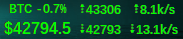
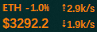
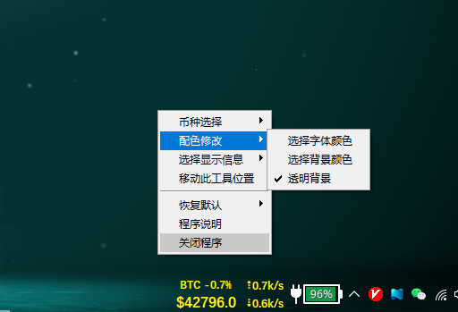

# 信息栏工具(InfobarTool)

## 依赖环境
程序使用python进行开发，使用版本：***v3.8.10***  
以下是使用python源代码所需的模块，在命令行使用`pip install 模块名`安装即可，国内受限用户
可使用`pip install 模块名 -i http://pypi.douban.com/simple/ --trusted-host pypi.douban.com`
- `requests`: 网页爬虫专用
- `psutil`: 获取本机网络流量信息
- `pywin32`: 获取窗口句柄  

## 功能
这是一个可以在win10状态栏上显示虚拟币价格和网速信息的工具，目前仅支持显示BTC和ETH两种虚拟币，
可进行实时价格、24h峰值和网速信息三种功能的单独、混合显示。  

~~~~~~
1. 当鼠标移至显示主界面， 小箭头↖变成小爱心❤的时候，点击鼠标右键便可呼出菜单
2. 可进行背景透明、文字和背景颜色更换等DIY设置 
3. 程序显示窗口位置可调

## 使用说明
本仓库提供exe打包文件（目前仅在win10版本测试），可前往右侧 ***release*** 下载最新打包版本
#### 验证口令
程序设定了第一次打开需要验证口令，验证口令文件为：*register.ini*
也可以在第一次需要验证时输入:`软件开发来自微信公众号：MD野生科技`，输入后自动生成验证口令文件，且文件存在则不需要再次验证。

## 感谢
虚拟币价格获取来源网站：[美元人民币汇率](https://www.usd-cny.com/btc)