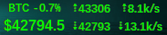
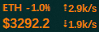
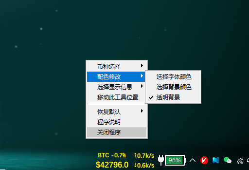

# 信息栏工具(InfobarTool)

## 依赖环境
程序使用python进行开发，版本：***v3.8.10***  

以下是使用python源代码所需的模块，在命令行使用`pip install 模块名`安装即可，国内受限用户
可使用`pip install 模块名 -i http://pypi.douban.com/simple/ --trusted-host pypi.douban.com`
- `requests`: 网页爬虫专用
- `psutil`: 获取本机网络流量信息
- `pywin32`: 获取窗口句柄  
#### 除此之外，更推荐使用以下方式：
`pip freeze > requirements.txt`: 将已安装模块信息输出到***requirements.txt***  

`pip install -r  requirements.txt`: 一次性安装***requirements.txt***中的所有模块

## 功能
**这是一个可以在win10状态栏上显示各种文字信息的工具，绿色，无多余窗口，并可根据需要自行DIY。**  

***补充说明：实时价格采用在线网站数据，有时会无数据，请耐心等待修复或本程序版本更新***

1. 支持虚拟币实时价格显示、币价24小时峰值、CPU和内存占用、网速信息等功能展示

2. 当鼠标移至显示主界面， 小箭头↖变成小爱心❤的时候，点击鼠标右键便可呼出菜单

3. 可进行背景透明、文字和背景颜色更换等DIY设置 
   

4. 程序显示窗口位置可调  

#### 主窗口图片：
　　　　　　　　　　　　
#### 菜单图：
　　　　　
## 使用说明
本仓库提供exe打包文件（目前仅在win10版本测试），可前往右侧 ***release*** 下载最新打包版本
#### 验证口令:
程序设定了第一次打开需要验证口令，验证口令文件为：*register.ini*
也可以在第一次需要验证时输入微信公众号名称:`MD野生科技`，输入后自动生成验证口令文件，且文件存在则不需要再次验证。

## 感谢
虚拟币价格获取来源网站：[美元人民币汇率](https://www.usd-cny.com/btc)